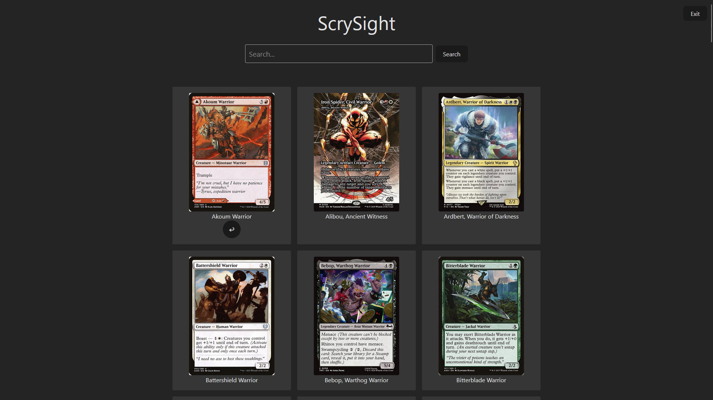
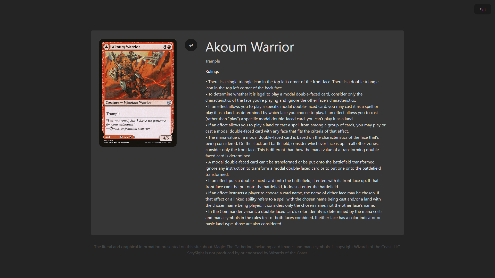

# ScrySight — a Magic: The Gathering Card Details and Rulings Reference
Quickly search for card details, rulings, and keyword definitions used in **Magic: The Gathering (MTG)**.  
Powered by the [Scryfall API](https://scryfall.com/docs/api).

## [Try ScrySight!](https://baileyloso.github.io/ScrySight/)


<br>

## Tech Stack
- [React](https://react.dev/)
- [TypeScript](https://www.typescriptlang.org/)
- [Vite](https://vitejs.dev/)

## Description
This is a personal project where my goal was to learn about web development using industry-standard tools. I chose to use JavaScript/TypeScript for the internal logic and React for creating a dynamic UI.

## Features
- Card search by name or Scryfall's search syntax.
- Display card art for each result.

- Support for double-sided cards.
- Find rulings specific to each card.


## Getting Started

Requirements: [Node.js](https://nodejs.org/).
```
git clone https://github.com/BaileyLoso/ScrySight.git
npm install
npm run dev
```

## Limitations
- Search results cannot be saved locally.
- Defining evergreen keywords present each card have not been fully implemented.

## Roadmap
- Implement pagination to improve site navigation.
- Show evergreen keywords present in each card and their precise definitions.
- Allow users to save cards for later viewing.
- Add deckbuilding feature.

## Credit
All card data is sourced from [Scryfall API](https://scryfall.com/docs/api). *Magic: The Gathering* is a property of Wizards of the Coast, and Scrysight offers card data in accordance with the [Wizards of the Coast Fan Content Policy](https://company.wizards.com/fancontentpolicy).
